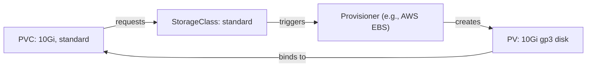

# What Is a StorageClass?

In the previous chapter, an administrator had to create PersistentVolumes manually before users could claim them. That works, but it doesn't scale. Imagine a team of 50 developers, each needing storage for their applications — the admin becomes a bottleneck, manually provisioning PVs all day.

**StorageClasses** solve this by enabling **dynamic provisioning**: users create a PVC, and the cluster automatically creates the PV for them. No admin intervention needed.

## The Concept

Think of a StorageClass as a menu at a restaurant. The menu describes what's available — fast SSD storage, standard HDD storage, replicated NFS — along with the properties of each option. Users (PVCs) order from the menu, and the kitchen (provisioner) prepares the dish (PV) automatically.

A StorageClass has four key components:

- **Provisioner:**  The driver that creates PVs. Could be a cloud provider (`kubernetes.io/aws-ebs`), a CSI driver, or `kubernetes.io/no-provisioner` for manual provisioning.
- **Parameters:**  Backend-specific options like disk type, IOPS, or zone.
- **Reclaim Policy:**  What happens to the PV when the PVC is deleted (`Delete` or `Retain`).
- **Volume Binding Mode:**  When provisioning happens: `Immediate` (as soon as the PVC is created) or `WaitForFirstConsumer` (when a Pod actually needs it).



:::info
Many cloud-managed clusters (EKS, GKE, AKS) come with a default StorageClass pre-configured. This means PVCs often "just work" without any StorageClass setup — the default handles provisioning automatically.
:::

## A StorageClass Example

Here's a basic StorageClass. This one uses `kubernetes.io/no-provisioner` (no dynamic provisioning — an admin still creates PVs), but it demonstrates the structure:

```yaml
apiVersion: storage.k8s.io/v1
kind: StorageClass
metadata:
  name: standard
provisioner: kubernetes.io/no-provisioner
volumeBindingMode: WaitForFirstConsumer
reclaimPolicy: Delete
```

In a real cloud environment, you'd use a provisioner like `ebs.csi.aws.com` (AWS), `pd.csi.storage.gke.io` (GCE), or `disk.csi.azure.com` (Azure), and the provisioner would create actual cloud disks.

## Immediate vs WaitForFirstConsumer

The `volumeBindingMode` controls **when** storage is provisioned:

- **Immediate:**  The PV is created as soon as the PVC appears. Simple, but the provisioner doesn't know which node the Pod will run on. This can cause problems in multi-zone clusters if storage is provisioned in zone A but the Pod runs in zone B.
- **WaitForFirstConsumer:**  Provisioning is delayed until a Pod actually references the PVC. The provisioner knows the Pod's node and can create storage in the right zone. This is the recommended mode for topology-aware storage.

## Multiple Storage Tiers

You can define multiple StorageClasses to offer different storage tiers:

- `fast-ssd` — High-IOPS SSD storage for databases
- `standard-hdd` — Cost-effective HDD storage for logs and backups
- `replicated-nfs` — Network storage with ReadWriteMany support

Users choose the tier that fits their workload by setting `storageClassName` in their PVC. This is a simple but powerful way to offer self-service storage with different performance and cost characteristics.

:::warning
If a PVC specifies a StorageClass that has **no provisioner** (like `kubernetes.io/no-provisioner`), it stays in Pending until an admin manually creates a matching PV. Make sure the StorageClass has a valid provisioner if you want dynamic provisioning.
:::

---

## Hands-On Practice

### Step 1: List all StorageClasses

```bash
kubectl get storageclass
```

Cloud-managed clusters (EKS, GKE, AKS) typically have at least one StorageClass. The default one is marked `(default)` in the output. Each class has a provisioner that creates PVs on demand.

### Step 2: Inspect a StorageClass in detail

```bash
kubectl describe storageclass standard
```

Replace `standard` with a StorageClass name from Step 1. The output shows the provisioner, reclaim policy, volume binding mode, and any parameters. Use this to understand what kind of storage a class provides.

## Wrapping Up

StorageClasses transform storage from a manual, admin-driven process into self-service dynamic provisioning. Users create PVCs, provisioners create PVs, and Kubernetes binds them together automatically. Use `WaitForFirstConsumer` for topology-aware placement, and define multiple classes to offer different storage tiers. In the next lessons, we'll look at default StorageClasses and how dynamic provisioning works end-to-end.
