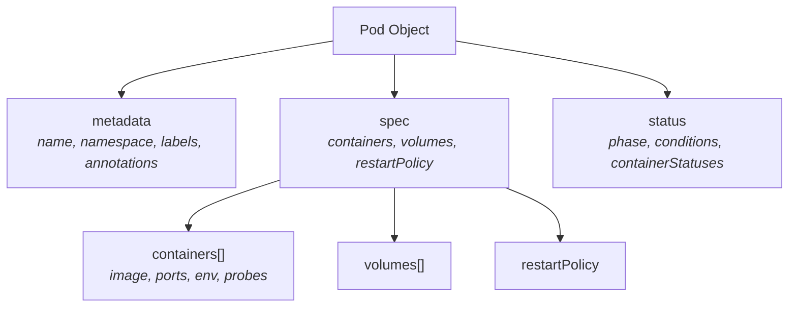
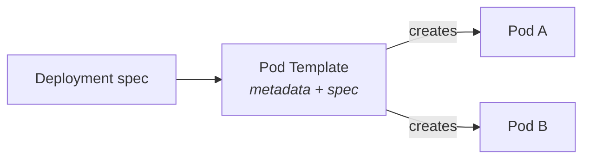

# Pod Structure

Now that you know what a Pod is, let's look at how one is actually defined. Every Kubernetes object — Pods included — follows a consistent structure. Understanding this structure is like learning to read a blueprint: once you can parse it, you can build, inspect, and troubleshoot anything.

## The Three Pillars of a Pod Definition

Every Pod is made of three main sections: **metadata**, **spec**, and **status**. Think of these as the *who*, the *what*, and the *how it's going*:

- **Metadata:**  identifies the Pod. Who is it? What is it called? Where does it live?
- **Spec:**  describes the desired state. What containers should run? What volumes do they need? What happens when they stop?
- **Status:**  reflects the current reality. Is the Pod running? Are its containers healthy? What phase is it in?

You write the metadata and spec. Kubernetes fills in the status for you.



## Metadata: The Pod's Identity Card

The `metadata` section carries everything Kubernetes needs to identify and organize your Pod:

- **`name`:**  a unique identifier within the namespace. Must follow DNS naming rules: lowercase letters, numbers, and hyphens only.
- **`namespace`:**  the logical grouping where the Pod lives (defaults to `default`).
- **`labels`:**  key-value pairs used to select and group Pods (e.g., `app: web`, `env: staging`). Controllers, Services, and other resources rely heavily on labels to find the right Pods.
- **`annotations`:**  key-value pairs for non-identifying metadata (build info, documentation links, tool configuration).
- **`ownerReferences`:**  automatically set when a controller (like a Deployment) creates the Pod, linking child to parent.

## Spec: The Desired State

The `spec` section is where you describe *what you want Kubernetes to run*. This is the heart of your Pod definition.

The most important field is **`containers`:**  a required list of one or more container definitions. Each container includes:

| Field       | Purpose                                              |
|-------------|------------------------------------------------------|
| `name`      | A unique name for the container within this Pod      |
| `image`     | The container image to pull and run                  |
| `ports`     | Ports the container listens on (informational + used by Services) |
| `env`       | Environment variables injected into the container    |
| `resources` | CPU and memory requests and limits                   |
| `probes`    | Liveness, readiness, and startup checks              |

Beyond containers, the spec also includes:

- **`volumes`:**  storage definitions that containers can mount.
- **`restartPolicy`:**  what happens when a container exits: `Always` (default), `OnFailure`, or `Never`.
- **`initContainers`:**  containers that run to completion *before* the main containers start. Useful for setup tasks like database migrations or config fetching.

:::info
Container names must be unique within a Pod, and containers sharing a Pod cannot bind to the same port. These are common sources of errors when working with multi-container Pods.
:::

## Status: The Current Reality

You never write the `status` section — Kubernetes manages it entirely. But you read it constantly when debugging. The key fields are:

- **`phase`:**  the high-level state of the Pod: `Pending`, `Running`, `Succeeded`, `Failed`, or `Unknown`.
- **`conditions`:**  a list of boolean conditions like `PodScheduled`, `ContainersReady`, and `Ready`, each with a status and reason.
- **`containerStatuses`:**  per-container details including current state (`Waiting`, `Running`, `Terminated`), restart count, and readiness.

## Pod Templates: Where Spec Meets Controllers

In practice, you rarely write a standalone Pod definition. Instead, you define a **pod template** inside a workload resource like a Deployment or StatefulSet. The template contains the same `metadata` and `spec` you would write for a Pod, and the controller uses it as a blueprint to create actual Pods.



:::warning
When you update a pod template in a Deployment, Kubernetes does **not** modify existing Pods in place. Instead, it creates new Pods with the updated configuration and gradually terminates the old ones. If your changes do not seem to take effect, check whether old Pods are still running.
:::

---

## Hands-On Practice

Pick any running Pod and dissect its internal structure.

### Step 1: View the Full YAML

```bash
kubectl get pod <pod-name> -o yaml
```

Scroll through and identify the three sections: `metadata`, `spec`, and `status`. Notice how `status` contains fields you never wrote — Kubernetes filled them in.

### Step 2: Extract Specific Fields with JSONPath

```bash
kubectl get pod <pod-name> -o jsonpath='{.spec.containers[*].name}'
kubectl get pod <pod-name> -o jsonpath='{.status.phase}'
kubectl get pod <pod-name> -o jsonpath='{.metadata.labels}'
```

JSONPath lets you pull exactly the data you need without scrolling through the full output.

## Wrapping Up

Every Pod is built from three sections: metadata (identity), spec (desired state), and status (current reality). You define the first two; Kubernetes manages the third. The spec is where the important decisions live — which containers to run, what volumes to mount, and how to handle restarts. In workload resources, the pod template carries this same structure and serves as the blueprint for every Pod the controller creates.

Now that you understand the anatomy of a Pod, it is time to put that knowledge into practice. In the next lesson, you will create your first Pod from scratch and watch Kubernetes bring it to life.
