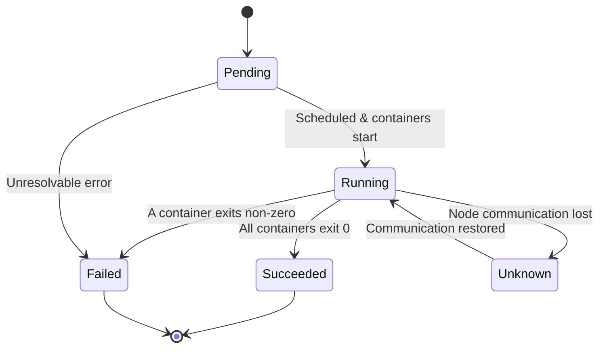

# Pod Phases

Every Pod in Kubernetes goes through a lifecycle, and at any moment, it sits in one of five **phases**. Think of these phases like the status board at an airport: a flight can be _Boarding_, _In Air_, _Landed_, or _Cancelled_ — you get a quick snapshot without knowing every detail about every passenger. Pod phases work the same way. They give you a high-level answer to the question: **"Where is this Pod in its journey?"**

In this lesson, you will learn to recognize each phase, understand what triggers transitions between them, and know which tools to reach for when a Pod is stuck.

## The Five Phases

A Pod's phase is stored in `status.phase`. Here are the five possible values:

| Phase         | What it means                                                                                                                                                  |
| ------------- | -------------------------------------------------------------------------------------------------------------------------------------------------------------- |
| **Pending**   | The cluster accepted the Pod, but it is not running yet. Kubernetes is scheduling it to a node, pulling container images, or waiting for resources to free up. |
| **Running**   | The Pod is bound to a node and at least one container is running (or starting/restarting).                                                                     |
| **Succeeded** | Every container in the Pod terminated with exit code 0 and will not be restarted. This is the happy ending for batch workloads like Jobs.                      |
| **Failed**    | Every container has terminated, and at least one exited with a non-zero code. Something went wrong.                                                            |
| **Unknown**   | Kubernetes cannot determine the Pod's state — usually because the node stopped reporting back.                                                                 |



:::info
Phase is deliberately simple. It will not tell you _which_ container is having trouble or _why_ a readiness probe is failing. For that level of detail, you need **container states** and **Pod conditions**, which we cover in the next lessons.
:::

## Walking Through the Phases

Let's follow a Pod from birth to completion.

**1 — Pending.** You apply a manifest. The API server persists the Pod object and the scheduler starts looking for a suitable node. During this time the Pod is _Pending_. Image pulls, Secret mounts, and resource constraints all keep a Pod in this phase until everything is ready.

**2 — Running.** The kubelet on the chosen node creates the containers. As soon as at least one container process is alive, the phase flips to _Running_. Important nuance: _Running_ does not mean "ready to serve traffic." A container can be running but still failing its readiness probe — which is why phase alone is never the full picture.

**3 — Succeeded or Failed.** When all containers have stopped, Kubernetes looks at exit codes. If every container returned 0, the phase is _Succeeded_. If any returned non-zero, it is _Failed_. These are **terminal** phases — the Pod will not transition out of them.

**4 — Unknown.** If the kubelet on the node stops communicating with the control plane (network partition, node crash, kubelet down), the phase becomes _Unknown_. Once communication is restored, the phase updates to reflect reality.

## Troubleshooting by Phase

When something goes wrong, the phase is your first breadcrumb:

- **Stuck in Pending:** The scheduler cannot place the Pod. Check resource requests (`kubectl describe pod`), node taints and tolerations, and node capacity (`kubectl describe node`).
- **Running but not Ready:** The Pod is alive but not serving traffic. This usually points to a failing readiness probe. We will cover probes in a dedicated module, but `kubectl describe pod` will show the probe status right away.
- **Failed:** Inspect container logs with `kubectl logs <pod-name>` and look at the exit code in `kubectl describe pod`. A non-zero exit code is your starting point for root-cause analysis.
- **Unknown:** Focus on the node, not the Pod. Check `kubectl get nodes` and `kubectl describe node <node-name>`. Network issues and kubelet crashes are the usual suspects.

:::warning
**Succeeded** and **Failed** are terminal states. Once a Pod reaches either, it will not restart on its own. Workload controllers like Deployments and Jobs are responsible for creating _new_ Pods when needed — the old Pod object remains for inspection until it is garbage-collected.
:::

---

## Hands-On Practice

### Step 1: Create a Pod and watch its phase transitions

```bash
nano phase-demo.yaml
```

Paste the following content:

```yaml
apiVersion: v1
kind: Pod
metadata:
  name: phase-demo
spec:
  containers:
    - name: nginx
      image: nginx
```

```bash
kubectl apply -f phase-demo.yaml
```

### Step 2: Watch the Pod in real time

```bash
kubectl get pod phase-demo -w
```

You should see the status progress from `Pending` → `ContainerCreating` → `Running`. Press `Ctrl+C` to stop watching.

### Step 3: Check the phase in the raw status

```bash
kubectl get pod phase-demo -o jsonpath='{.status.phase}'
```

This returns the exact value of `status.phase` — one of the five phases you learned about.

### Step 4: Inspect the events timeline

```bash
kubectl describe pod phase-demo
```

Scroll to the **Events** section to see the chronological story: scheduling, image pull, container start.

### Step 5: Create a Pod that will fail

```bash
nano fail-demo.yaml
```

```yaml
apiVersion: v1
kind: Pod
metadata:
  name: fail-demo
spec:
  restartPolicy: Never
  containers:
    - name: fail
      image: busybox
      command: ['sh', '-c', 'exit 1']
```

```bash
kubectl apply -f fail-demo.yaml
```

Wait a few seconds, then check:

```bash
kubectl get pod fail-demo
```

The status should show `Error` or `Failed` — because the container exited with a non-zero code and `restartPolicy: Never` prevents Kubernetes from restarting it.

### Step 6: Clean up

```bash
kubectl delete pod phase-demo fail-demo
```

## Wrapping Up

Pod phases give you a fast, at-a-glance picture of where a Pod stands in its lifecycle. Five values — **Pending**, **Running**, **Succeeded**, **Failed**, and **Unknown:** cover every possibility. They are intentionally broad: think of them as the chapter titles of a Pod's story, not the full text. To read the full story, you need the finer-grained tools we explore next: **container states** (what each individual container is doing) and **Pod conditions** (whether specific health checks have passed). With phase as your starting compass, you will always know which direction to investigate.
