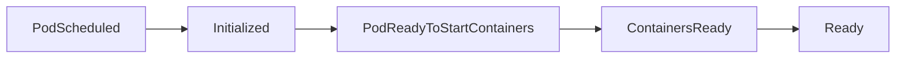

# Pod Conditions

You now know how to read a Pod's **phase** (the big picture) and its **container states** (what each container is doing). But there is a third layer of information that answers an entirely different question: **"Has this Pod passed the checks it needs to function properly?"**

That is the role of **Pod conditions**. Think of them as a preflight checklist for an aircraft. Before a plane takes off, the crew verifies fuel, instruments, doors, and clearances — each item is either *checked* or *not checked*. Similarly, Kubernetes maintains a list of conditions for every Pod, and each one is either `True`, `False`, or `Unknown`. Only when all the critical conditions are `True` does the Pod get the green light to receive traffic.

## Anatomy of a Condition

Every condition in the `status.conditions` array has these fields:

| Field | Purpose |
|---|---|
| `type` | The name of the check (e.g., `Ready`, `PodScheduled`). |
| `status` | `True`, `False`, or `Unknown`. |
| `lastTransitionTime` | When the status last changed. |
| `reason` | A machine-readable one-word reason (e.g., `ContainersNotReady`). |
| `message` | A human-readable explanation. |

The `reason` and `message` fields are your debugging allies — they tell you *why* a condition is not met, saving you from guesswork.

## The Key Conditions

Kubernetes evaluates several conditions for each Pod. Here are the ones you will encounter most often, in the order they typically become `True`:



**PodScheduled:**  The scheduler found a node for this Pod. If this is `False`, the Pod cannot even begin. Common blockers: insufficient CPU or memory on available nodes, unsatisfied node selectors, or unmatched taints and tolerations.

**Initialized:**  All <a target="_blank" href="https://kubernetes.io/docs/concepts/workloads/pods/init-containers/">init containers</a> have completed successfully. Init containers run sequentially before app containers start. If one fails, the Pod stays in an initializing state and this condition remains `False`.

**PodReadyToStartContainers:**  The Pod sandbox is created and networking is configured. This is a relatively recent addition and confirms that the infrastructure layer is in place.

**ContainersReady:**  Every container in the Pod is passing its readiness probe (or, if no probe is defined, is simply running). This is a container-level roll-up.

**Ready:**  The Pod is fully ready to serve requests and is added to the endpoint list of any matching Service. This is the condition that controls whether traffic reaches your Pod.

:::info
The **Ready** condition is the gatekeeper for traffic. A Service only sends requests to Pods whose Ready condition is `True`. If your application takes time to warm up, define a readiness probe so that the Ready condition reflects actual readiness — not just "the process started."
:::

## The Relationship Between Ready and Traffic

This is one of the most important concepts in Kubernetes networking. When you create a Service, it watches for Pods that match its selector. But it does not blindly forward traffic to every matching Pod — it only includes Pods where `Ready` is `True`.

This means:

1. A Pod that is `Running` but not `Ready` **will not receive traffic** from the Service.
2. If a running Pod's readiness probe starts failing, Kubernetes removes it from the Service's endpoints **automatically**.
3. Once the probe passes again, the Pod is re-added.

This self-healing behavior keeps unhealthy instances out of your load-balancing pool without manual intervention.

## Debugging with Conditions

When a Pod is not behaving as expected, conditions narrow down the problem area quickly:

- **PodScheduled: False:**  The scheduler cannot place the Pod. Investigate node capacity, taints, affinities, and resource requests.
- **Initialized: False:**  An init container has not finished. Check init container logs with `kubectl logs <pod-name> -c <init-container-name>`.
- **ContainersReady: False:**  A container is not passing its readiness probe. Review the probe configuration and the application's actual health endpoint.
- **Ready: False:**  Often follows from `ContainersReady: False`, but can also be influenced by <a target="_blank" href="https://kubernetes.io/docs/concepts/workloads/pods/readiness-gates/">readiness gates</a> if your cluster uses them.

:::warning
If no readiness probe is defined, Kubernetes considers a container ready the moment it starts. This can be misleading — your application might need 30 seconds to load data, but the Pod will already be receiving traffic. Always define readiness probes for production workloads.
:::

---

## Hands-On Practice

### Step 1: Create a Pod with a readiness probe

```bash
nano conditions-demo.yaml
```

```yaml
apiVersion: v1
kind: Pod
metadata:
  name: conditions-demo
spec:
  containers:
    - name: nginx
      image: nginx
      readinessProbe:
        httpGet:
          path: /
          port: 80
        initialDelaySeconds: 5
        periodSeconds: 3
```

```bash
kubectl apply -f conditions-demo.yaml
```

### Step 2: Inspect conditions immediately

```bash
kubectl describe pod conditions-demo
```

Look at the **Conditions** section. Right after creation, you will likely see `ContainersReady: False` and `Ready: False`.

### Step 3: Wait and check again

Wait about 10 seconds for the readiness probe to pass, then:

```bash
kubectl describe pod conditions-demo
```

Both `ContainersReady` and `Ready` should now be `True`. That is the preflight checklist completing in real time.

### Step 4: Extract conditions programmatically

```bash
kubectl get pod conditions-demo -o jsonpath='{.status.conditions}' | jq .
```

### Step 5: Check which Pods are ready

```bash
kubectl get pods
```

The `READY` column reflects the Ready condition — `1/1` means all containers are ready.

### Step 6: Clean up

```bash
kubectl delete pod conditions-demo
```

## Wrapping Up

Pod conditions are the **preflight checklist** of the Kubernetes lifecycle. They answer precise yes-or-no questions: is this Pod scheduled? Are init containers done? Are all containers ready? Is the Pod as a whole ready for traffic? Unlike phases and container states, conditions are directly tied to real-world consequences — especially the **Ready** condition, which controls whether a Service sends traffic to the Pod. Learning to read conditions fluently will make you significantly faster at diagnosing problems. In the next and final lesson of this chapter, we look at **restart policies:**  the rules that govern what happens when a container exits.
