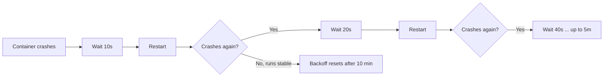

# Restart Policies

At this point, you understand Pod phases, container states, and conditions. You know how to read the signals Kubernetes gives you about a Pod's health and readiness. But one question remains: **when a container exits, what happens next?**

That is determined by the Pod's **restart policy**. Think of it as the safety net under a trapeze artist. Some performers want the net to catch them every time they fall (long-running services). Others want it only if something goes wrong (batch jobs that might fail). And some prefer no net at all — they perform once and walk away (one-shot tasks). Kubernetes gives you exactly these three options.

## The Three Restart Policies

The `restartPolicy` field lives in the Pod spec and accepts one of three values:

| Policy        | Behavior                                                            | Best for                                            |
| ------------- | ------------------------------------------------------------------- | --------------------------------------------------- |
| **Always**    | Restart the container after _any_ exit, whether success or failure. | Long-running services (web servers, APIs, workers). |
| **OnFailure** | Restart only if the container exits with a non-zero code.           | Batch jobs that may hit transient errors.           |
| **Never**     | Do not restart the container, regardless of exit code.              | One-shot tasks that should run exactly once.        |

**The default is `Always`**, which makes sense for the most common Kubernetes workload: a service that should stay up indefinitely.

:::info
The restart policy applies to **all containers** in the Pod — you cannot set different policies for different containers within the same Pod.
:::

## Choosing the Right Policy

The choice comes down to the nature of your workload:

**Long-running services:** A web server or API should always come back if it crashes. Use `Always` (or simply omit the field to get the default). Kubernetes will keep restarting the container for as long as the Pod exists on the node.

```yaml
apiVersion: v1
kind: Pod
metadata:
  name: web-server
spec:
  restartPolicy: Always
  containers:
    - name: app
      image: nginx
```

**Jobs that may fail transiently:** A data-processing task that occasionally fails due to a timeout or a temporary network issue benefits from automatic retries. Use `OnFailure` so the container restarts on error but stays terminated when it succeeds.

```yaml
apiVersion: batch/v1
kind: Job
metadata:
  name: data-processor
spec:
  template:
    spec:
      restartPolicy: OnFailure
      containers:
        - name: worker
          image: busybox
          command: ['sh', '-c', 'process-data']
```

**One-shot tasks:** A database migration or a report generator that should run once and exit. Use `Never` so there is no restart regardless of the outcome.

:::warning
Job Pod templates **reject** `restartPolicy: Always`. If you try to use it, the Job controller will refuse to create the Pod. Use `OnFailure` or `Never` for any Pod managed by a Job or CronJob.
:::

## The Exponential Backoff Mechanism

When the kubelet restarts a container, it does not do so immediately every time. It applies an **exponential backoff**: the first restart happens after 10 seconds, the next after 20, then 40, 80, 160, up to a maximum of **5 minutes**. This prevents a crashing container from hammering the node in a tight restart loop.



Once the container runs successfully for **10 minutes**, the backoff timer resets to 10 seconds. This means a container that crashes once and then recovers will get a quick restart the next time it has trouble.

You can spot the backoff in action when `kubectl get pods` shows the status **CrashLoopBackOff**. The container is in the Waiting state, and Kubernetes is counting down before the next restart attempt.

## Restart Policy vs. Workload Controllers

An important distinction: the restart policy governs restarts **on the same node**. If the Pod is deleted, evicted (due to node pressure), or the node itself goes down, the restart policy does nothing — it is a node-local mechanism.

**Workload controllers** like Deployments, ReplicaSets, and Jobs are the ones that create _replacement Pods_ on other nodes. The restart policy and the controller work at different levels:

| Scenario                               | Who handles it                                                        |
| -------------------------------------- | --------------------------------------------------------------------- |
| Container crashes inside a running Pod | **Restart policy** (kubelet restarts the container)                   |
| Pod is evicted or node goes down       | **Workload controller** (creates a new Pod on a healthy node)         |
| Pod is manually deleted                | **Workload controller** (creates a replacement to meet desired state) |

This is why standalone Pods (not managed by any controller) are risky in production — if the node fails, nobody recreates them.

---

## Hands-On Practice

### Step 1: Create a Pod with `restartPolicy: Always` (default)

```bash
nano restart-always.yaml
```

```yaml
apiVersion: v1
kind: Pod
metadata:
  name: restart-always
spec:
  containers:
    - name: crash
      image: busybox
      command: ['sh', '-c', "echo 'starting'; sleep 3; exit 1"]
```

```bash
kubectl apply -f restart-always.yaml
```

### Step 2: Watch the restarts accumulate

```bash
kubectl get pod restart-always -w
```

Watch for about 30 seconds. You will see the RESTARTS counter climb and the status cycle through `Running` → `Error` → `CrashLoopBackOff` → `Running`. Press `Ctrl+C`.

### Step 3: Check restart details

```bash
kubectl describe pod restart-always
```

Look at the **Restart Count** and **Last State** fields. The Last State should show `Terminated` with exit code `1`.

### Step 4: Create a Pod with `restartPolicy: Never`

```bash
nano restart-never.yaml
```

```yaml
apiVersion: v1
kind: Pod
metadata:
  name: restart-never
spec:
  restartPolicy: Never
  containers:
    - name: crash
      image: busybox
      command: ['sh', '-c', "echo 'starting'; sleep 3; exit 1"]
```

```bash
kubectl apply -f restart-never.yaml
```

Wait about 10 seconds, then check:

```bash
kubectl get pods
```

The Pod should show `Error` status with `0` restarts — it ran once, failed, and stayed terminated.

### Step 5: Clean up

```bash
kubectl delete pod restart-always restart-never
```

## Wrapping Up

Restart policies — **Always**, **OnFailure**, and **Never:** give you precise control over what happens when a container exits. `Always` keeps services running indefinitely, `OnFailure` retries failed batch work, and `Never` enforces one-shot execution. The exponential backoff mechanism protects your cluster from rapid crash loops, and workload controllers complement restart policies by handling scenarios beyond a single node. With phases, container states, conditions, and restart policies under your belt, you now have a complete understanding of the **Pod lifecycle:** the foundation for everything else you will build in Kubernetes.
