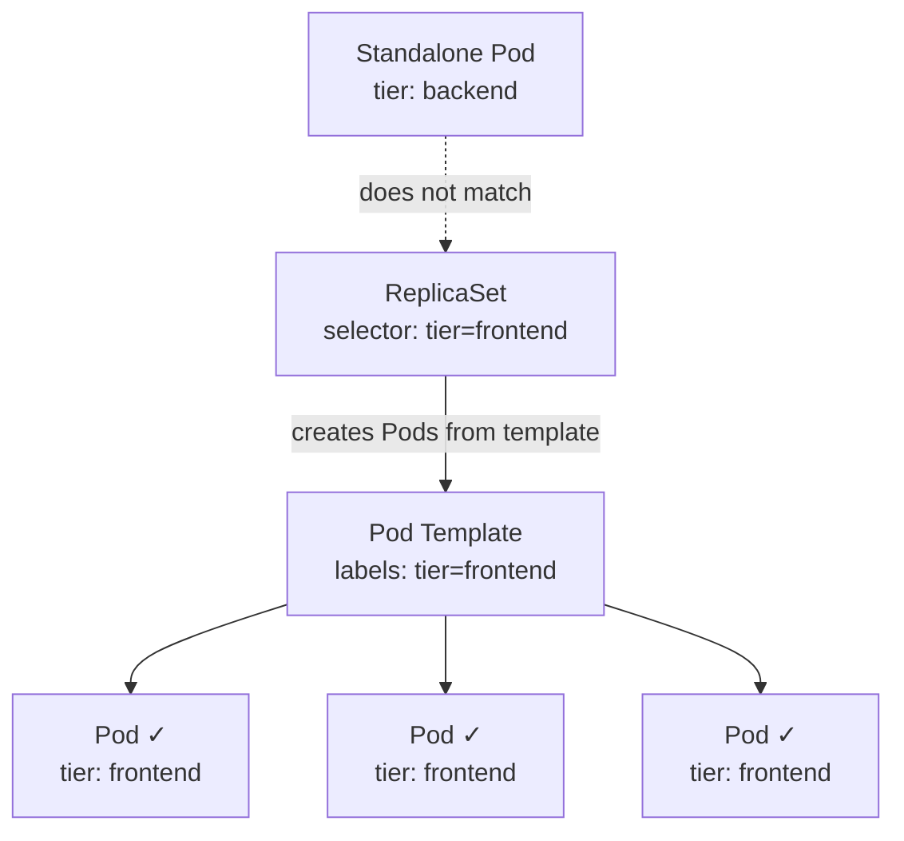

# ReplicaSet Selectors

## The Glue Between a ReplicaSet and Its Pods

In the previous lesson, you learned that a ReplicaSet maintains a desired number of Pods. But how does the ReplicaSet *know* which Pods belong to it? The cluster could have hundreds of Pods running — from different applications, teams, and environments. The ReplicaSet needs a reliable way to say: *"These Pods are mine."*

That mechanism is the **label selector**.

Think of it like a teacher taking attendance in a school with many classrooms. The teacher doesn't look for students by name one by one — instead, every student in their class wears a specific colored badge. The teacher simply counts the students wearing that badge. Labels are the badges, and the selector is the rule for which badge color to look for.

## How Label Selectors Work

Every ReplicaSet has a `.spec.selector` field that defines the criteria for matching Pods. Kubernetes supports two styles of matching:

### `matchLabels` — Equality-Based Selection

This is the most common approach. You specify one or more key-value pairs, and a Pod must have **all** of them to match.

```yaml
spec:
  selector:
    matchLabels:
      app: web
      tier: frontend
```

A Pod needs both `app: web` **and** `tier: frontend` to be considered part of this ReplicaSet. If it only has one of them, it does not match.

### `matchExpressions` — Set-Based Selection

For more advanced use cases, `matchExpressions` lets you use operators like `In`, `NotIn`, `Exists`, and `DoesNotExist`:

```yaml
spec:
  selector:
    matchExpressions:
      - key: environment
        operator: In
        values: [production, staging]
```

This matches any Pod whose `environment` label is either `production` or `staging`. You can combine `matchLabels` and `matchExpressions` — a Pod must satisfy **all** conditions to match.

For most ReplicaSet use cases, `matchLabels` is all you need. Set-based expressions become more useful with more complex controllers and scheduling rules.

## The Golden Rule: Template Labels Must Match the Selector

This is one of the most important rules to internalize:

> The labels defined in `.spec.template.metadata.labels` **must satisfy** the `.spec.selector`.

Why? Because when the ReplicaSet creates a new Pod from the template, that Pod needs to match the selector so the ReplicaSet can recognize and manage it. If the template produces Pods that don't match, the ReplicaSet would create Pods endlessly without ever reaching its desired count.

Kubernetes enforces this at the API level — if your template labels don't match the selector, **the manifest is rejected before anything is created**.



:::warning
The selector is **immutable** after creation. Once a ReplicaSet exists, you cannot change its `.spec.selector`. If you need a different selector, you must delete the ReplicaSet and create a new one. This is another reason why Deployments are preferred — they handle ReplicaSet replacement for you.
:::

## Ownership and `ownerReferences`

When a ReplicaSet creates a Pod, Kubernetes automatically sets a field called `metadata.ownerReferences` on that Pod. This field points back to the ReplicaSet and establishes a formal **ownership chain**.

This matters for two reasons:

1. **Garbage collection:**  if you delete the ReplicaSet, Kubernetes knows to delete its Pods too.
2. **Conflict prevention:**  two ReplicaSets with overlapping selectors won't fight over the same Pods because ownership is tracked explicitly.

You can inspect this relationship by listing Pods matching the selector and reading their `ownerReferences` field — it will show the ReplicaSet's name, UID, and the `controller: true` flag confirming it is the managing controller.

## Pod Adoption: A Double-Edged Sword

Here is a subtlety worth knowing: a ReplicaSet can **adopt** existing Pods that match its selector, even if those Pods were not created from its template. If a standalone Pod happens to have the right labels and no existing owner, the ReplicaSet will claim it.

This sounds convenient, but it can lead to surprises. Imagine you manually create a Pod with `tier: frontend` for quick testing. If a ReplicaSet with that selector is running and already has enough replicas, it might **terminate your Pod** to stay at the desired count.

:::info
To avoid accidental adoption, use specific and unique label combinations for your ReplicaSets. The more precise your selectors, the less likely you are to encounter unexpected ownership conflicts.
:::

---

## Hands-On Practice

### Step 1: Create a ReplicaSet with a specific selector

```bash
nano selector-demo.yaml
```

```yaml
apiVersion: apps/v1
kind: ReplicaSet
metadata:
  name: selector-demo
spec:
  replicas: 2
  selector:
    matchLabels:
      tier: frontend
  template:
    metadata:
      labels:
        tier: frontend
    spec:
      containers:
        - name: nginx
          image: nginx:1.25
```

```bash
kubectl apply -f selector-demo.yaml
```

### Step 2: List Pods matching the selector

```bash
kubectl get pods -l tier=frontend
```

You should see 2 Pods created by the ReplicaSet.

### Step 3: Check ownership

```bash
kubectl get pod <pod-name> -o jsonpath='{.metadata.ownerReferences[0].name}'
```

It should return `selector-demo` — confirming the ReplicaSet owns this Pod.

### Step 4: Test Pod adoption — create a standalone Pod with matching labels

```bash
nano orphan-pod.yaml
```

```yaml
apiVersion: v1
kind: Pod
metadata:
  name: orphan-frontend
  labels:
    tier: frontend
spec:
  containers:
    - name: nginx
      image: nginx:1.25
```

```bash
kubectl apply -f orphan-pod.yaml
```

Now check:

```bash
kubectl get pods -l tier=frontend
```

The ReplicaSet wants 2 replicas but now sees 3 matching Pods — it will terminate one to stay at the desired count.

### Step 5: Clean up

```bash
kubectl delete rs selector-demo
```

## Wrapping Up

Label selectors are the connection between a ReplicaSet and the Pods it manages. The selector defines *what to look for*, and the template labels ensure that newly created Pods are always found. The two must match — Kubernetes enforces this strictly.

Remember that selectors are immutable once created, that `ownerReferences` track the ownership chain, and that Pods matching a selector can be adopted even if they were created elsewhere. Keeping your labels **specific and intentional** is the best way to avoid surprises.

In the next lesson, you will put all of this together by creating a ReplicaSet from scratch and observing it in action.
