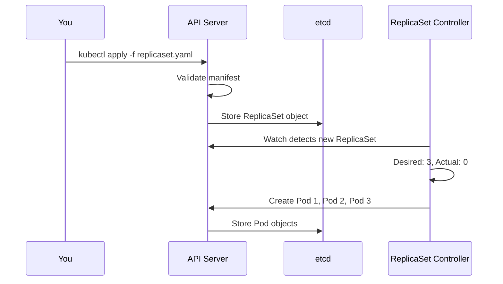
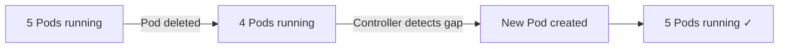

# Creating a ReplicaSet

## From Theory to Practice

You now understand what a ReplicaSet is and how selectors connect it to its Pods. It is time to put that knowledge into action. In this lesson, you will write a ReplicaSet manifest from scratch, apply it to a cluster, observe the Pods it creates, and learn how to scale it up and down.

## Anatomy of the Manifest

Here is a complete ReplicaSet manifest:

```yaml
apiVersion: apps/v1
kind: ReplicaSet
metadata:
  name: frontend
  labels:
    app: guestbook
    tier: frontend
spec:
  replicas: 3
  selector:
    matchLabels:
      tier: frontend
  template:
    metadata:
      labels:
        tier: frontend
    spec:
      containers:
        - name: php-redis
          image: nginx:1.25
          ports:
            - containerPort: 80
```

| Section                     | What It Does                                                                                 |
| --------------------------- | -------------------------------------------------------------------------------------------- |
| `apiVersion: apps/v1`       | Tells Kubernetes which API group and version to use. ReplicaSets belong to the `apps` group. |
| `kind: ReplicaSet`          | The type of object you are creating.                                                         |
| `metadata.name`             | A unique name for this ReplicaSet within its namespace.                                      |
| `spec.replicas`             | The desired number of Pod copies. Here, we want **3**.                                       |
| `spec.selector.matchLabels` | The label selector. The ReplicaSet manages Pods with `tier: frontend`.                       |
| `spec.template`             | The blueprint for creating Pods. Its labels **must match** the selector.                     |

:::info
The labels on the ReplicaSet's own `metadata` (like `app: guestbook`) are for your organizational purposes — they do not affect which Pods the ReplicaSet manages. Only the **selector** determines Pod ownership.
:::

When you apply this manifest, Kubernetes validates it, stores it in etcd, and the ReplicaSet controller immediately creates 3 Pods to satisfy the desired replica count.



:::warning
Scaling **down** terminates Pods. If your application needs to handle in-flight requests or save state before shutting down, make sure your containers respond to the `SIGTERM` signal and perform a **graceful shutdown**. Kubernetes sends `SIGTERM` and waits for a grace period (default: 30 seconds) before forcefully killing the container.
:::

---

## Hands-On Practice

### Step 1: Create the manifest file

```bash
nano replicaset.yaml
```

Paste the manifest from above, save, and exit.

### Step 2: Apply the manifest

```bash
kubectl apply -f replicaset.yaml
```

### Step 3: Verify the ReplicaSet

```bash
kubectl get rs frontend
```

You should see:

```
NAME       DESIRED   CURRENT   READY   AGE
frontend   3         3         3       30s
```

When all three numbers match, your ReplicaSet is fully operational.

### Step 4: List the Pods it created

```bash
kubectl get pods -l tier=frontend
```

### Step 5: Inspect the ReplicaSet events

```bash
kubectl describe rs frontend
```

The `Events` section shows exactly when and why Pods were created.

### Step 6: Scale up to 5 replicas

```bash
kubectl scale rs frontend --replicas=5
```

Verify:

```bash
kubectl get pods -l tier=frontend
```

You should now see 5 Pods.

### Step 7: Test self-healing — delete a Pod

```bash
kubectl delete pod <pod-name>
```

Check again:

```bash
kubectl get pods -l tier=frontend
```

A **new Pod** appeared with a fresh name and a recent `AGE`. The ReplicaSet detected the gap and created a replacement.



### Step 8: Clean up

```bash
kubectl delete rs frontend
```

This also deletes all Pods owned by the ReplicaSet.

:::info
To delete the ReplicaSet but **keep the Pods** running, use `kubectl delete rs frontend --cascade=orphan`. Orphaned Pods lose their safety net — no controller will recreate them if they fail.
:::

## Wrapping Up

You have now gone through the full lifecycle of a ReplicaSet: writing the manifest, applying it, verifying the result, scaling up and down, and observing self-healing in action. The key fields to remember are `spec.replicas`, `spec.selector`, and `spec.template` — and the cardinal rule that **template labels must match the selector**.

In practice, you will rarely create ReplicaSets directly. The next chapter introduces **Deployments**, which wrap ReplicaSets with rolling update and rollback capabilities. But everything you have learned here — the reconciliation loop, selectors, ownership, and scaling — carries directly into Deployments. You now have a solid foundation to build on.
