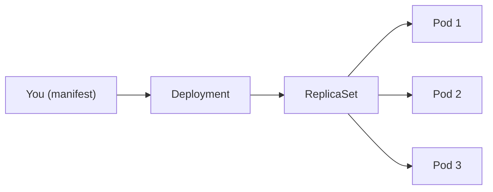

# What is a Deployment?

If ReplicaSets are the engine that keeps the right number of Pods running, then a **Deployment** is the driver — the higher-level controller that tells the engine what to do, when to change gears, and how to get from version A to version B without stopping the car.

A Deployment is the most common and recommended way to run applications on Kubernetes. It manages the full lifecycle of your Pods: creation, scaling, updates, and self-healing. But it never touches Pods directly. Instead, it delegates that work to ReplicaSets, creating a clean chain of responsibility.

## The Chain of Command

Understanding the relationship between Deployments, ReplicaSets, and Pods is essential. Think of it as a management hierarchy:

- **You** declare a desired state (e.g., "I want 3 replicas of my web server running nginx:1.21").
- The **Deployment** interprets that intent and creates a ReplicaSet to fulfill it.
- The **ReplicaSet** ensures the correct number of Pods are running at all times.
- **Pods** run your actual containers.



You interact with the Deployment. The Deployment manages ReplicaSets. The ReplicaSets manage Pods. This layered architecture is what makes rolling updates and rollbacks possible — the Deployment can create a _new_ ReplicaSet with updated configuration while gradually scaling down the _old_ one.

## Declarative by Design

Deployments follow the declarative model at the heart of Kubernetes. You don't tell Kubernetes _how_ to run your application step by step. Instead, you describe _what_ you want, and the Deployment controller — a control loop running inside the cluster — continuously works to make reality match your declaration.

If a Pod crashes, the controller notices the gap and creates a replacement. If you change the replica count, it adjusts. If you update the container image, it orchestrates a rolling update. This reconciliation loop runs constantly, which is why Kubernetes is described as a **self-healing** system.

## A Minimal Deployment Manifest

Here is a straightforward Deployment that runs three replicas of an nginx web server:

```yaml
apiVersion: apps/v1
kind: Deployment
metadata:
  name: nginx-deploy
spec:
  replicas: 3
  selector:
    matchLabels:
      app: nginx
  template:
    metadata:
      labels:
        app: nginx
    spec:
      containers:
        - name: nginx
          image: nginx:1.21
```

Let's break down the key fields:

- **`replicas: 3`:** the desired number of identical Pods.
- **`selector.matchLabels`:** tells the Deployment which Pods it owns. This must match the labels in the Pod template.
- **`template`:** the blueprint for every Pod the Deployment creates. Change this template, and the Deployment triggers a rolling update.

:::info
Kubernetes adds a `pod-template-hash` label to every ReplicaSet and Pod created by a Deployment. This hash is derived from the Pod template and guarantees that each ReplicaSet only manages the Pods it created — never someone else's.
:::

## When to Use a Deployment

Deployments are designed for **stateless applications:** workloads where any replica can handle any request and no Pod needs a stable identity or persistent local storage. Common examples include:

- Web servers and frontends
- REST APIs and GraphQL services
- Microservices and background workers

For **stateful workloads:** databases, message brokers, or anything requiring stable network identity and persistent storage — Kubernetes provides <a target="_blank" href="https://kubernetes.io/docs/concepts/workloads/controllers/statefulset/">StatefulSets</a>, which are purpose-built for those needs.

:::warning
Never manually modify or delete ReplicaSets that belong to a Deployment. The Deployment controller owns them, and any manual changes will be overwritten or cause unexpected behavior. Always make changes through the Deployment itself.
:::

---

## Hands-On Practice

### Step 1: List Existing Deployments

```bash
kubectl get deploy
```

The output shows columns like `READY`, `UP-TO-DATE`, and `AVAILABLE`, giving you an at-a-glance view of each Deployment's health.

### Step 2: Inspect the Ownership Chain

```bash
kubectl get pods --show-labels
```

Look for the `pod-template-hash` label — this ties each Pod to its specific ReplicaSet version, which is itself managed by the Deployment.

## Wrapping Up

A Deployment is the standard way to run and manage stateless applications in Kubernetes. It sits above ReplicaSets in the resource hierarchy, handling Pod lifecycle, self-healing, scaling, rolling updates, and rollbacks — all driven by a simple declarative manifest. You describe what you want, and the Deployment controller takes care of the rest. In the next lesson, you will create your first Deployment and see this entire chain come to life.
