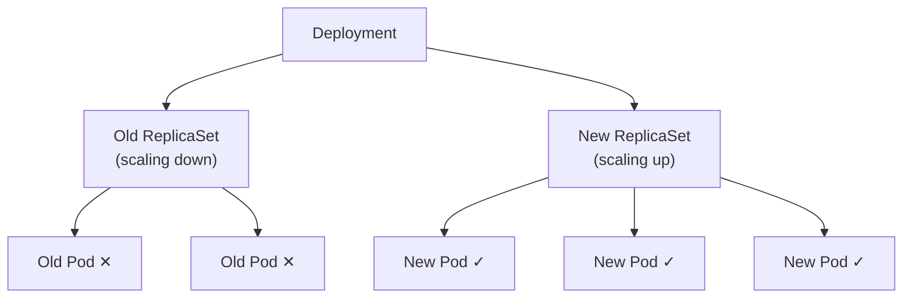

# Rolling Updates

Imagine you need to repaint a bridge while traffic continues to flow. You would not shut down the entire bridge at once. Instead, you would close one lane, repaint it, reopen it, then move to the next lane. That is exactly how **rolling updates** work in Kubernetes — your application is updated gradually, one piece at a time, so that users never experience downtime.

Rolling updates are the default update strategy for Deployments, and they are one of the most compelling reasons to use Kubernetes in the first place.

## What Triggers a Rolling Update?

A rollout is triggered whenever the **Pod template** (`.spec.template`) changes. This includes modifications to the container image, environment variables, resource limits, volume mounts — anything inside the template.

Changes that do **not** trigger a rollout include scaling (`spec.replicas`), updating metadata labels on the Deployment itself, or modifying the strategy configuration. The distinction matters: scaling adjusts the Pod count within the current ReplicaSet, while a template change creates an entirely new ReplicaSet.

## The Rolling Update Mechanism

When you change the Pod template, the Deployment controller orchestrates a carefully coordinated dance between two ReplicaSets:

1. A **new ReplicaSet** is created with the updated Pod template.
2. The new ReplicaSet is gradually **scaled up:**  new Pods are created and must pass readiness checks.
3. The **old ReplicaSet** is gradually **scaled down:**  old Pods are terminated as new ones become ready.
4. The process continues until the new ReplicaSet has all the desired replicas and the old ReplicaSet has zero.



Throughout this process, a minimum number of Pods remain available to serve traffic. This is what enables **zero-downtime deployments**.

## Controlling the Pace: maxSurge and maxUnavailable

Two parameters give you fine-grained control over the rollout speed and availability guarantees:

- **`maxSurge`:**  the maximum number of Pods that can exist *above* the desired replica count during the update. More surge means faster rollouts, because more new Pods can spin up in parallel.
- **`maxUnavailable`:**  the maximum number of Pods that can be *unavailable* during the update. Higher values speed up the rollout but reduce the number of Pods serving traffic.

Both values can be absolute numbers or percentages. The defaults are **25% each**.

For a Deployment with 4 replicas and default settings:
- **maxSurge 25%** → up to 1 extra Pod (5 total at peak)
- **maxUnavailable 25%** → at most 1 Pod unavailable (at least 3 serving traffic)

Here is how to configure these values explicitly:

```yaml
spec:
  strategy:
    type: RollingUpdate
    rollingUpdate:
      maxSurge: 1
      maxUnavailable: 0
```

Setting `maxUnavailable: 0` is a conservative choice — the full desired count stays available at all times during the update. No user request is ever dropped due to missing capacity. The trade-off is a slightly slower rollout, because Kubernetes must wait for each new Pod to be ready before terminating an old one.

:::info
For production workloads where availability is critical, `maxUnavailable: 0` with a reasonable `maxSurge` (e.g., 1 or 25%) is a solid starting configuration. It guarantees that you never dip below full capacity during an update.
:::

## Monitoring a Rolling Update

Once an update is in flight, you can watch its progress with `kubectl rollout status deployment/<name>`, which blocks until the rollout completes or fails and gives real-time feedback. For a broader view, watch the Pods transition between ReplicaSets with `kubectl get pods -l app=nginx -w` — you will see old Pods moving to `Terminating` state while new Pods go through `ContainerCreating` and then `Running`.

## Pausing and Resuming

Sometimes you want to roll out a change to a few Pods, observe their behavior, and then continue. Kubernetes supports this with pause and resume:

```bash
kubectl rollout pause deployment/nginx-deployment
```

While paused, the rollout stops mid-way. The Deployment is partially updated — some Pods run the new version, others still run the old one. This gives you a window to inspect logs, test endpoints, or verify metrics. When you are satisfied:

```bash
kubectl rollout resume deployment/nginx-deployment
```

The rollout picks up where it left off.

:::warning
A large `maxUnavailable` value can cause brief periods of reduced capacity during updates. For services with tight SLAs, keep this value low and rely on `maxSurge` to speed up the rollout instead. If a rollout gets stuck — perhaps due to a bad image or failing readiness probes — use `kubectl rollout undo deployment/<name>` to revert immediately.
:::

---

## Hands-On Practice

### Step 1: Create a deployment with 3 replicas of nginx:1.14.2

```bash
kubectl create deployment nginx-deploy --image=nginx:1.14.2 --replicas=3
```

**Observation:** Three Pods running nginx:1.14.2 are created.

### Step 2: Trigger a rolling update by changing the image

```bash
kubectl set image deployment/nginx-deploy nginx=nginx:1.16.1
```

**Observation:** A rollout begins immediately. The Deployment controller creates a new ReplicaSet with the updated image.

### Step 3: Watch Pods Transition in Real Time

```bash
kubectl get pods -l app=nginx-deploy -w
```

**Observation:** (Press Ctrl+C to stop.) During the rollout you see old Pods in `Terminating` and new Pods in `ContainerCreating` then `Running`. This is the rolling update mechanism in action.

### Step 4: Clean up

```bash
kubectl delete deployment nginx-deploy
```

**Observation:** The Deployment and all its Pods are removed.

---

## Wrapping Up

Rolling updates replace Pods gradually by creating a new ReplicaSet and scaling it up while scaling the old one down. This happens automatically whenever you change the Pod template. You control the pace with `maxSurge` and `maxUnavailable`, monitor progress with `kubectl rollout status`, and can pause or undo at any point. In the next lesson, you will put this into practice by updating a live Deployment.
