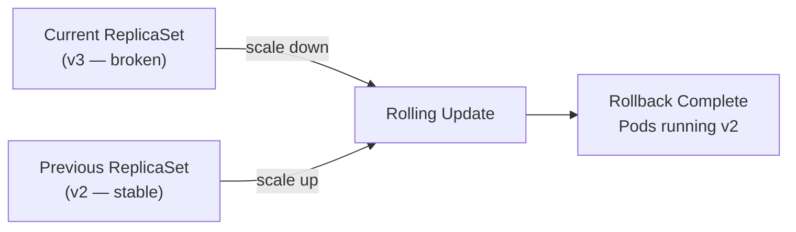

# Rollback Basics

## The Safety Net for Your Deployments

Imagine you've just shipped a new version of your application. Traffic is flowing, users are active — and then alerts fire. The new version has a critical bug. What do you do?

In traditional infrastructure, this moment could mean panic: scrambling to rebuild artifacts, redeploying manually, hoping nothing else breaks along the way. But Kubernetes was designed with exactly this scenario in mind. Every time you change a Deployment's Pod template, Kubernetes quietly stores a snapshot of that configuration as a **revision**. These revisions act like a version history for your Deployment — a time machine you can use to rewind to a known-good state in seconds.

This is what rollbacks are all about: the ability to **undo a Deployment update** and return to a previous revision, quickly and safely.

## Understanding Revisions

Before diving into rollback commands, let's clarify what a revision actually is.

Each time you modify the **Pod template** section of a Deployment (for example, changing the container image, adding environment variables, or updating resource limits), Kubernetes creates a new revision. Think of it as an automatic checkpoint.

However, not everything triggers a new revision. **Scaling changes:**  increasing or decreasing the replica count — do not create revisions. Only template-level changes do.

Kubernetes keeps a limited history of these revisions, controlled by the `revisionHistoryLimit` field (default: **10**). Once the limit is exceeded, older revisions are discarded and can no longer be used as rollback targets.

:::info
Only Pod template changes create new revisions. Scaling a Deployment up or down does not affect the revision history.
:::

You can inspect the full revision history of any Deployment at any time:

```bash
kubectl rollout history deployment/nginx-deployment
```

This outputs a numbered list of revisions. Each entry corresponds to a distinct Pod template configuration that was applied at some point.

## How Rollbacks Work Under the Hood

When you trigger a rollback, Kubernetes doesn't perform any special magic — it reuses the same **rolling update** mechanism you already know. Here's the sequence:

1. The Deployment controller looks up the Pod template from the target revision.
2. It creates (or reactivates) a ReplicaSet based on that template.
3. It gradually scales up the old ReplicaSet while scaling down the current one, following your `maxSurge` and `maxUnavailable` settings.

In other words, a rollback is simply a **rolling update in reverse:**  moving from the current template back to a previous one. The same health checks, the same gradual transition, the same zero-downtime guarantees apply.



## Performing a Rollback

The most common rollback command reverts to the **immediately previous** revision:

```bash
kubectl rollout undo deployment/nginx-deployment
```

This is your go-to when the latest change is the problem. But sometimes the issue isn't in the last revision — perhaps the last two updates both had issues. In that case, you can target a **specific revision** by number:

```bash
kubectl rollout undo deployment/nginx-deployment --to-revision=2
```

Once the rollback is initiated, monitor its progress just like any other rollout:

```bash
kubectl rollout status deployment/nginx-deployment
```

This command blocks until the rollback completes (or fails), giving you real-time feedback.

## Verifying the Rollback

After the rollback finishes, confirm everything is in the expected state. Check the Deployment status, inspect the ReplicaSets (the rollback target should have the desired replica count while others are at zero), and verify the container image with `kubectl describe deployment | grep Image`. If the image matches the revision you targeted, the rollback succeeded.

:::warning
If `revisionHistoryLimit` was exceeded, older revisions may no longer be available. In that case, you'll need to manually fix the Pod template and apply it as a new update rather than rolling back.
:::

## Best Practices for Production Rollbacks

Rollbacks are a **reactive safety measure**, not a deployment strategy. Here are a few guidelines to keep them reliable:

- **Keep `revisionHistoryLimit` appropriate** for your deployment frequency. If you deploy multiple times a day, consider raising it above the default of 10.
- **Always check rollout history first** before rolling back. Make sure the target revision actually contains the configuration you want.
- **Use `--to-revision` explicitly** when you need precision. Blindly undoing to "the previous one" works in simple cases but can surprise you if multiple updates happened in quick succession.
- **Treat rollback as triage, not a fix.** After reverting, investigate the root cause and ship a proper correction. Relying on repeated rollbacks can leave your revision history in a confusing state.

---

## Hands-On Practice

### Step 1: Create a Deployment with nginx:1.14.2

```bash
kubectl create deployment nginx-deployment --image=nginx:1.14.2 --replicas=3
```

You now have a Deployment running three Pods on nginx 1.14.2.

### Step 2: Update to nginx:1.16.1

```bash
kubectl set image deployment/nginx-deployment nginx=nginx:1.16.1
```

The rolling update begins; new Pods are created with the updated image.

### Step 3: Inspect Rollout History

```bash
kubectl rollout history deployment/nginx-deployment
```

You see revision 1 (nginx:1.14.2) and revision 2 (nginx:1.16.1). This history is what enables rollback.

### Step 4: Rollback to the Previous Revision

```bash
kubectl rollout undo deployment/nginx-deployment
```

Kubernetes starts a rolling update in reverse, scaling down the current ReplicaSet and scaling up the previous one.

### Step 5: Verify the Rollback

```bash
kubectl get rs
kubectl describe deployment nginx-deployment
```

The active ReplicaSet should again use nginx:1.14.2. The Deployment's image field and ReplicaSet status confirm the rollback succeeded.

### Step 6: Clean Up

```bash
kubectl delete deployment nginx-deployment
```

---

## Wrapping Up

Rollbacks are one of the most reassuring features of Kubernetes Deployments. With `kubectl rollout history`, you can inspect every revision. With `kubectl rollout undo`, you can revert to a previous state — either the last revision or a specific one using `--to-revision=N`. Under the hood, a rollback is just another rolling update, so you get the same gradual, safe transition.

With rolling updates and rollbacks now in your toolkit, you have solid control over stateless workloads. In the next module, we'll step into a different territory: **StatefulSets**, which manage workloads that need stable identity, persistent storage, and ordered operations.
