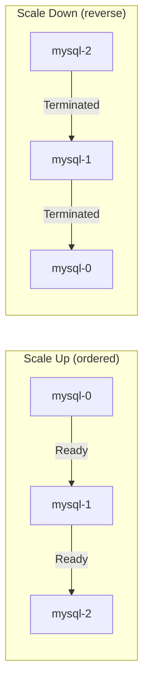

# What is a StatefulSet?

## When Identity Matters

Up to this point, every workload we've managed — Pods through Deployments and ReplicaSets — has been **stateless**. Pods are interchangeable, disposable, and nameless in practice. If one dies, another takes its place with a new name, a new IP, and no memory of its predecessor. For web servers, API gateways, and many microservices, this is perfectly fine.

But what about a database cluster? A distributed message queue? An Elasticsearch ring? These systems need something Deployments can't provide: **identity**. Each instance must know who it is, where its data lives, and which peers surround it. Replacing a database node with a brand-new stranger that has no idea which shard it owns would be catastrophic.

This is the problem **StatefulSets** solve. They manage Pods that need a **stable, persistent identity:** a fixed name, reliable storage, and predictable ordering — even when Pods are rescheduled, restarted, or moved across nodes.

## The Apartment Building Analogy

Think of a Deployment as a hotel: guests come and go, rooms are interchangeable, and nobody cares which specific room they're in. A StatefulSet, on the other hand, is like an **apartment building**. Each tenant has a permanent unit number, a mailbox with their name on it, and a storage locker that belongs to them. If a tenant temporarily leaves, their apartment number, mail, and belongings stay exactly where they are — waiting for their return.

In Kubernetes terms:

- The **apartment number** is the Pod's stable name (`mysql-0`, `mysql-1`, `mysql-2`).
- The **mailbox** is the stable DNS entry each Pod receives.
- The **storage locker** is the PersistentVolume attached to each Pod.

## How StatefulSets Work

When you create a StatefulSet with three replicas, Kubernetes doesn't launch all three Pods simultaneously. Instead, it creates them **one at a time, in order**:

1. `mysql-0` is created first and must become Ready.
2. Only then is `mysql-1` created.
3. Finally, `mysql-2` is created.

This ordered startup matters for distributed systems. Many databases require a primary node to be running before replicas can join the cluster.

Scaling down follows the **reverse order**: `mysql-2` is removed first, then `mysql-1`, and `mysql-0` last. This predictability is essential for graceful data migration and leader election.



When a Pod is rescheduled (for example, if the node it was running on fails), the replacement Pod gets the **same name** and can **reattach to the same PersistentVolume**. The Pod's identity survives the reschedule — its data is intact, and other Pods can still reach it at the same DNS address.

## The Headless Service Requirement

StatefulSets have one hard requirement that Deployments don't: they need a **Headless Service**. A Headless Service is a regular Kubernetes Service with `clusterIP: None`. Instead of providing a single virtual IP that load-balances across Pods, a Headless Service lets DNS return the **individual Pod IPs** directly.

This enables each Pod to have its own stable DNS name following the pattern:

```
<pod-name>.<service-name>.<namespace>.svc.cluster.local
```

For example, with a Headless Service named `mysql` in the `default` namespace, your Pods are reachable at:

- `mysql-0.mysql.default.svc.cluster.local`
- `mysql-1.mysql.default.svc.cluster.local`
- `mysql-2.mysql.default.svc.cluster.local`

This is how distributed systems discover and communicate with specific peers — not "some random database instance," but "the exact node responsible for shard 2."

:::warning
You must create the Headless Service **before** the StatefulSet. The StatefulSet's `serviceName` field must exactly match the name of this Service. Forgetting this step — or mismatching the names — will cause DNS identity issues.
:::

## A Minimal Example

Here is the simplest StatefulSet setup — a Headless Service paired with a StatefulSet:

```yaml
apiVersion: v1
kind: Service
metadata:
  name: mysql
spec:
  clusterIP: None
  selector:
    app: mysql
---
apiVersion: apps/v1
kind: StatefulSet
metadata:
  name: mysql
spec:
  serviceName: mysql
  replicas: 3
  selector:
    matchLabels:
      app: mysql
  template:
    metadata:
      labels:
        app: mysql
    spec:
      containers:
        - name: mysql
          image: mysql:8
```

After applying this manifest, Kubernetes will create `mysql-0`, then `mysql-1`, then `mysql-2` — each with a stable DNS identity provided by the Headless Service.

## When to Use StatefulSets

StatefulSets are the right choice when your workload requires one or more of the following:

- **Stable network identity:** each Pod must be individually addressable (databases, distributed caches).
- **Stable persistent storage:** each Pod needs its own PersistentVolume that survives rescheduling.
- **Ordered deployment and scaling:** Pods must start and stop in a specific sequence.

Common use cases include distributed databases (MySQL, PostgreSQL, MongoDB, Cassandra), message brokers (Kafka, RabbitMQ), and search engines (Elasticsearch).

:::info
If your application is stateless and doesn't need stable identity or persistent per-Pod storage, a Deployment is simpler and more appropriate. Reserve StatefulSets for workloads that genuinely need them.
:::

## StatefulSets vs. Deployments at a Glance

| Feature        | Deployment                    | StatefulSet                   |
| -------------- | ----------------------------- | ----------------------------- |
| Pod names      | Random (e.g., `nginx-7d9f5b`) | Predictable (e.g., `mysql-0`) |
| Startup order  | All at once                   | Sequential (0, 1, 2…)         |
| Shutdown order | Any order                     | Reverse (…2, 1, 0)            |
| Storage        | Shared or none                | Per-Pod PersistentVolumes     |
| DNS identity   | Via Service (shared IP)       | Per-Pod via Headless Service  |
| Best for       | Stateless apps                | Stateful, distributed systems |

---

## Hands-On Practice

### Step 1: List Existing StatefulSets

```bash
kubectl get statefulsets
```

If any StatefulSets exist in the cluster, they appear here with their replica counts and status.

### Step 2: Inspect Pods with Ordinal Names

```bash
kubectl get pods
```

If StatefulSet Pods exist in the cluster, their names follow the `<name>-0`, `<name>-1`, `<name>-2` pattern — stable, predictable ordinal identifiers.

---

## Wrapping Up

A StatefulSet gives each Pod something Deployments never do: a **stable, persistent identity**. Pods receive predictable names (`mysql-0`, `mysql-1`, `mysql-2`), individual DNS entries through a Headless Service, and the ability to reattach to their own PersistentVolume after rescheduling. Creation happens in order, deletion in reverse — providing the guarantees that distributed, stateful systems depend on.

In the next lesson, we'll look more closely at how StatefulSets, Headless Services, and DNS work together to form the foundation of stateful workload management.
