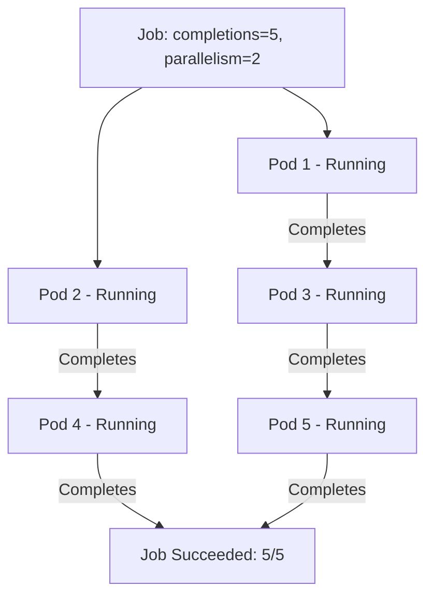

# Job Specification

## The Blueprint of a Job

In the previous lesson, you learned that a Job runs Pods to completion. But how do you tell Kubernetes _how many_ times a task should run? Can multiple Pods work in parallel? What happens if something takes too long?

The answers lie in the **Job spec:** a small set of powerful fields that act as a blueprint for your batch workload. Think of it like a work order you hand to a construction crew: it specifies how many units to build, how many workers can operate simultaneously, how many mistakes are tolerable, and the hard deadline for the project.

Let's explore each field in detail.

## The Four Key Fields

### `completions` — How Many Successes You Need

The `completions` field defines the **total number of Pods that must exit successfully** before the Job is considered done. It defaults to `1`.

If you set `completions: 5`, the Job controller will keep creating Pods until exactly 5 have finished with exit code 0. It does not matter how many fail along the way (within the retry limit) — the controller only counts successes.

This is useful when you need to process multiple independent units of work. For example, if you have 5 chunks of data to transform, you can set `completions: 5` so each chunk gets its own Pod.

### `parallelism` — How Many Pods Run at Once

The `parallelism` field controls the **maximum number of Pods running concurrently**. It defaults to `1`, meaning Pods run one after another — sequential processing.

Raising this value is like adding more workers to an assembly line. With `parallelism: 3`, up to 3 Pods can run at the same time. The Job controller will keep launching new Pods (up to this limit) as earlier ones complete, until the `completions` target is reached.



The combination of `completions` and `parallelism` gives you fine-grained control. Five completions with a parallelism of 2 means: "run 5 tasks total, but never more than 2 at the same time."

### `backoffLimit` — How Many Failures Are Tolerable

Pods can fail for many reasons — a bug in the code, a missing dependency, a transient network error. The `backoffLimit` field defines **how many total Pod failures** the Job tolerates before it gives up entirely and transitions to Failed. The default is `6`.

Each retry creates a **new Pod** (when `restartPolicy: Never`) or restarts the container in-place (when `restartPolicy: OnFailure`). The controller uses exponential backoff between retries — 10 seconds, 20 seconds, 40 seconds, and so on — capped at 6 minutes.

:::info
The `backoffLimit` counts **total failures across all Pods**, not per-Pod retries. If you set `completions: 5` and `backoffLimit: 3`, the entire Job fails after 3 Pod failures — even if 4 out of 5 completions already succeeded. Choose this value carefully based on how flaky your workload is.
:::

### `activeDeadlineSeconds` — The Hard Deadline

Sometimes a task must finish within a specific time window — perhaps because a downstream system is waiting, or because a long-running failure would waste cluster resources. The `activeDeadlineSeconds` field sets a **wall-clock time limit** on the entire Job.

If the Job has not completed (succeeded or failed via `backoffLimit`) within this many seconds, Kubernetes terminates all running Pods and marks the Job as Failed. This is your safety net against runaway batch workloads.

:::warning
`activeDeadlineSeconds` is measured from the **moment the Job starts**, not from each individual Pod's creation. It is a hard ceiling on the total duration of the Job. If your workload legitimately needs more time, increase this value — but always set one in production to prevent indefinite resource consumption.
:::

## Putting It All Together

Here is a Job that combines all four fields into a complete specification:

```yaml
apiVersion: batch/v1
kind: Job
metadata:
  name: batch-worker
spec:
  completions: 5
  parallelism: 2
  backoffLimit: 6
  activeDeadlineSeconds: 300
  template:
    spec:
      containers:
        - name: worker
          image: busybox
          command:
            ['sh', '-c', 'echo Processing item... && sleep 5 && echo done']
      restartPolicy: OnFailure
```

This Job says: "Run 5 tasks total, 2 at a time, retry up to 6 failures, and the whole thing must finish within 5 minutes."

Apply it and observe the execution:

```bash
kubectl apply -f batch-worker.yaml
kubectl get jobs --watch
```

The `--watch` flag lets you see completions increment in real time. You can also inspect individual Pods:

```bash
kubectl get pods -l job-name=batch-worker
kubectl describe job batch-worker
```

In the `describe` output, look for the **Events** section — it shows when Pods were created and completed, giving you a clear picture of the execution timeline.

## Choosing the Right Values

Selecting the right combination of these fields depends on your workload:

| Scenario                     | completions | parallelism | backoffLimit | activeDeadlineSeconds |
| ---------------------------- | ----------- | ----------- | ------------ | --------------------- |
| Single migration script      | 1           | 1           | 3            | 600                   |
| Process 10 files in parallel | 10          | 4           | 6            | 1800                  |
| Quick health check           | 1           | 1           | 1            | 30                    |
| Large batch with retries     | 100         | 10          | 20           | 7200                  |

Start conservative — low parallelism, moderate backoff — and increase based on observed behavior. High parallelism can overwhelm your cluster's scheduling capacity if nodes are already loaded, so always verify that your cluster has enough resources to handle the concurrency you configure.

---

## Hands-On Practice

### Step 1: Create a Simple Job Manifest

Create `job.yaml` with a Job that runs busybox and echoes a message:

```bash
nano job.yaml
```

Use this minimal spec:

```yaml
apiVersion: batch/v1
kind: Job
metadata:
  name: hello-job
spec:
  template:
    spec:
      containers:
        - name: hello
          image: busybox
          command: ['sh', '-c', 'echo Hello from Job']
      restartPolicy: Never
```

Save and exit.

### Step 2: Apply and Watch Completion

```bash
kubectl apply -f job.yaml
kubectl get jobs -w
```

The Job shows `0/1` initially, then `1/1` once the Pod completes. Press Ctrl+C to stop watching.

### Step 3: Check Pod Status and Logs

```bash
kubectl get pods -l job-name=hello-job
kubectl logs job/hello-job
```

The Pod status is `Completed`, and the logs show "Hello from Job".

### Step 4: Clean Up

```bash
kubectl delete job hello-job
```

---

## Wrapping Up

The Job spec gives you four essential controls: `completions` defines the success target, `parallelism` sets the concurrency level, `backoffLimit` governs failure tolerance, and `activeDeadlineSeconds` enforces a hard time limit. Together, they let you express a wide range of batch processing patterns — from simple one-shot tasks to large parallel workloads.

In the next lesson, we will explore the **Job lifecycle:** how Jobs transition through phases, what happens when they succeed or fail, and how to manage cleanup of completed Jobs.
