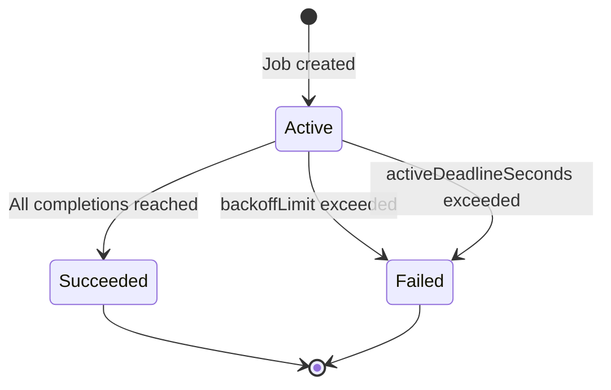

# Job Lifecycle

## From Start to Finish

You now know what a Job is and how to configure its spec. The final piece of the puzzle is understanding **what happens after you create a Job:** how it moves through phases, how Kubernetes tracks its progress, and what happens to all those Pods once the work is done.

Think of a Job's lifecycle like a project timeline on a task board. The project starts in an **active** state while work is underway. It eventually moves to **succeeded** if everything goes well, or **failed** if too many problems pile up. And once the project is closed, you need to decide: do you archive the records, or shred them?

## The Three Phases

Every Job exists in one of three phases at any given moment:



### Active

The moment you create a Job, it enters the **Active** phase. The Job controller begins creating Pods from the template, and at least one Pod is either running or pending (waiting to be scheduled). The Job stays Active as long as work is in progress.

You can observe this state with:

```bash
kubectl get jobs
```

The output shows columns like `COMPLETIONS` (e.g., `2/5`) and `DURATION`, giving you a quick snapshot of progress. For deeper insight:

```bash
kubectl describe job <job-name>
```

The **Events** section at the bottom reveals exactly when Pods were created, completed, or failed — a detailed activity log for your Job.

### Succeeded

When the number of successfully completed Pods reaches the `completions` target, the Job transitions to **Succeeded**. No more Pods are created, and the Job is considered done.

The Job object **remains in the cluster:** it does not disappear. Its completed Pods also remain, which is intentional: you can still inspect their logs, review exit codes, and verify the output.

```bash
kubectl logs job/<job-name>
```

This retrieves the output from one of the completed Pods. If your Job created multiple Pods, you can list them and read logs from specific ones:

```bash
kubectl get pods -l job-name=<job-name>
kubectl logs <specific-pod-name>
```

### Failed

A Job transitions to **Failed** when either of these conditions is met:

- **Pod failures exceed `backoffLimit`:** the controller gave up after too many retries.
- **Total runtime exceeds `activeDeadlineSeconds`:** the hard deadline was reached, and all remaining Pods were terminated.

A Failed Job also stays in the cluster. This is important for debugging: you can inspect the Job's conditions, look at Pod events, and examine container logs to understand what went wrong.

```bash
kubectl describe job <job-name>
```

Look at the **Conditions** section — it will show a `Failed` condition with a reason like `BackoffLimitExceeded` or `DeadlineExceeded`, telling you exactly why the Job did not succeed.

## What Happens to Completed Pods?

This is one of the most common sources of confusion for newcomers. After a Job finishes — whether it succeeded or failed — the **Job object and all its Pods remain in the cluster**. They are not running (no CPU or memory consumed), but they still exist as API objects.

This default behavior is deliberate. It lets you:

- Read logs from completed Pods
- Inspect exit codes and container statuses
- Review events for troubleshooting

But if you have Jobs running regularly (nightly reports, hourly data syncs), this means completed Jobs and Pods will **accumulate over time**, cluttering your namespace and consuming etcd storage.

## Automatic Cleanup with TTL

Kubernetes provides a built-in mechanism for cleaning up finished Jobs: the `ttlSecondsAfterFinished` field. It tells the <a target="_blank" href="https://kubernetes.io/docs/concepts/workloads/controllers/ttlafterfinished/">TTL-after-finished controller</a> to delete the Job and all its Pods a certain number of seconds after the Job completes.

```yaml
apiVersion: batch/v1
kind: Job
metadata:
  name: cleanup-demo
spec:
  ttlSecondsAfterFinished: 120
  template:
    spec:
      containers:
        - name: worker
          image: busybox
          command: ['sh', '-c', 'echo Task complete']
      restartPolicy: Never
```

In this example, 120 seconds after the Job finishes (succeeded or failed), Kubernetes automatically deletes the Job and its Pods. You get a 2-minute window to inspect the results, and then the cluster cleans up after itself.

:::info
Setting `ttlSecondsAfterFinished: 0` deletes the Job **immediately** after completion. This is useful for fire-and-forget tasks where you do not need to inspect the output, but be careful — you will lose access to Pod logs the moment the Job finishes.
:::

If you prefer manual cleanup, you can always delete a Job and its Pods with:

```bash
kubectl delete job <job-name>
```

:::warning
Deleting a Job **cascades to its Pods:** they are removed as well. Make sure you have already retrieved any logs or output you need before deleting. If you only want to remove the Job object while keeping the Pods, use `kubectl delete job <job-name> --cascade=orphan`.
:::

## Choosing a Cleanup Strategy

The right approach depends on your environment:

| Strategy                       | When to use                                                                          |
| ------------------------------ | ------------------------------------------------------------------------------------ |
| No TTL (default)               | Development and debugging — you want to inspect everything at your own pace          |
| `ttlSecondsAfterFinished: 300` | Production Jobs where you want a short window for log inspection                     |
| `ttlSecondsAfterFinished: 0`   | High-frequency Jobs (every few minutes) where logs are shipped to an external system |
| Manual `kubectl delete`        | Ad-hoc Jobs where you decide case-by-case                                            |

In production environments, combining `ttlSecondsAfterFinished` with a centralized logging solution (so logs are preserved externally) is the most common pattern. This way, the cluster stays clean while you retain full observability.

## Debugging a Stuck or Failed Job

When a Job does not behave as expected, here is a systematic approach:

**Job stuck in Active:** Pods might be pending due to insufficient resources or scheduling constraints. Check Pod status:

```bash
kubectl get pods -l job-name=<job-name>
kubectl describe pod <pod-name>
```

Look for events like `FailedScheduling` or `Insufficient cpu`.

**Job marked as Failed:** Inspect the Job's conditions and the last Pod's logs:

```bash
kubectl describe job <job-name>
kubectl logs -l job-name=<job-name> --tail=50
```

The conditions section reveals whether it was a `BackoffLimitExceeded` or `DeadlineExceeded` failure, guiding you toward the right fix.

---

## Hands-On Practice

### Step 1: Create a Failing Job with backoffLimit: 2

Create a Job that exits with code 1:

```bash
cat <<EOF | kubectl apply -f -
apiVersion: batch/v1
kind: Job
metadata:
  name: failing-job
spec:
  backoffLimit: 2
  template:
    spec:
      containers:
        - name: fail
          image: busybox
          command: ["sh", "-c", "exit 1"]
      restartPolicy: Never
EOF
```

### Step 2: Observe Retries and Job Status

```bash
kubectl get pods -l job-name=failing-job
kubectl describe job failing-job
```

You see multiple Pods created and failed. The Job eventually transitions to Failed after exceeding `backoffLimit`.

### Step 3: Create a Successful Job with completions: 3

```bash
cat <<EOF | kubectl apply -f -
apiVersion: batch/v1
kind: Job
metadata:
  name: multi-completion-job
spec:
  completions: 3
  template:
    spec:
      containers:
        - name: worker
          image: busybox
          command: ["sh", "-c", "echo Done"]
      restartPolicy: Never
EOF
```

### Step 4: Observe Sequential Completion

```bash
kubectl get jobs -w
kubectl get pods -l job-name=multi-completion-job
```

Pods run one after another (default parallelism 1) until 3 completions are reached.

### Step 5: Clean Up

```bash
kubectl delete job failing-job multi-completion-job
```

---

## Wrapping Up

A Job's lifecycle follows a clear path: **Active** while Pods are running, **Succeeded** when all completions are reached, and **Failed** when retry or time limits are exceeded. Completed Jobs and Pods remain in the cluster by default for inspection. Use `ttlSecondsAfterFinished` to automate cleanup, or delete Jobs manually when you are done.

With this lesson, you have a complete understanding of Kubernetes Jobs — from their purpose, through their configuration, to their full lifecycle. You are now equipped to run batch workloads, one-off tasks, and data processing pipelines with confidence.
