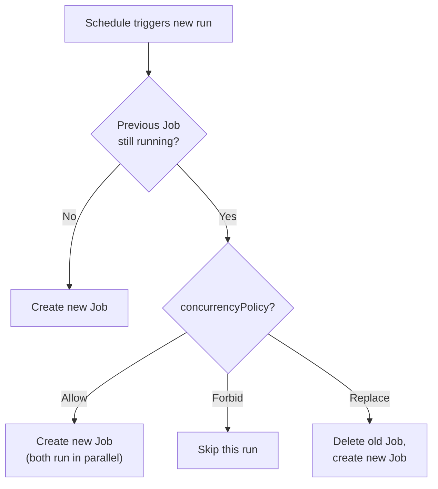

# CronJob Specification

In the previous lesson, you created a CronJob that runs on a schedule and produces Jobs automatically. That is powerful on its own, but real-world scheduling comes with questions that a simple schedule and template cannot answer: *What happens if a Job is still running when the next one is due? How many old Jobs should the cluster keep around?*

This lesson walks you through the key fields of the CronJob spec that give you precise control over these behaviors.

## The Overlap Problem

Imagine a nightly backup CronJob scheduled at 2 AM. Most nights the backup finishes in 20 minutes. But one night, the database is larger than usual and the Job takes over 24 hours. When 2 AM rolls around again, should Kubernetes start a second backup alongside the first? Should it skip the new run? Or should it cancel the slow one and start fresh?

This is the exact problem that **`concurrencyPolicy`** solves.

## Concurrency Policy

The `concurrencyPolicy` field accepts three values:

| Value | Behavior |
|---|---|
| **Allow** (default) | A new Job is created even if the previous one is still running. Multiple runs can overlap. |
| **Forbid** | The new run is **skipped** if the previous Job has not finished yet. |
| **Replace** | The currently running Job is **terminated**, and a new one is started in its place. |

Think of it like a meeting room with a single projector:

- **Allow:**  anyone can walk in and start presenting, even if someone else is already mid-presentation. It gets chaotic.
- **Forbid:**  if the room is occupied, the next presenter waits outside and their slot is skipped entirely.
- **Replace:**  the current presenter is asked to leave so the new one can start immediately.



For most production workloads, **Forbid** is the safest starting point — especially for tasks like backups or data migrations where overlapping runs could cause data corruption or resource contention.

:::warning
The default policy is `Allow`, which means overlapping Jobs can pile up silently if your task is slower than your schedule interval. Always set `concurrencyPolicy` explicitly in production CronJobs to avoid surprises.
:::

## Job History Limits

Every time a CronJob fires, it creates a new Job object. Over days and weeks, these accumulate. Kubernetes provides two fields to manage this automatically:

- **`successfulJobsHistoryLimit`:**  how many completed (successful) Jobs to retain. Default: **3**.
- **`failedJobsHistoryLimit`:**  how many failed Jobs to retain. Default: **1**.

Older Jobs beyond these limits are garbage-collected along with their Pods. This keeps your cluster tidy while still preserving enough history to inspect recent runs and debug failures.

:::info
History limits are per CronJob. If you have five different CronJobs, each maintains its own independent history. Lowering the limits saves cluster resources, but make sure you keep enough failed Jobs to have time to investigate problems before they disappear.
:::

## A Production-Ready Example

Here is a CronJob configured for a nightly database backup — a realistic scenario that brings all the fields together:

```yaml
apiVersion: batch/v1
kind: CronJob
metadata:
  name: db-backup
spec:
  schedule: "0 2 * * *"
  concurrencyPolicy: Forbid
  successfulJobsHistoryLimit: 5
  failedJobsHistoryLimit: 3
  jobTemplate:
    spec:
      template:
        spec:
          containers:
            - name: backup
              image: backup-tool:1.4
              command: ["/bin/sh", "-c", "backup-database.sh"]
          restartPolicy: OnFailure
```

Let's break this down:

- **`schedule: "0 2 * * *"`:**  runs every day at 2:00 AM (in the controller's time zone, typically UTC).
- **`concurrencyPolicy: Forbid`:**  if last night's backup is somehow still running, tonight's run is skipped rather than starting a conflicting second backup.
- **`successfulJobsHistoryLimit: 5`:**  keeps the last five successful backup Jobs so you can review recent runs.
- **`failedJobsHistoryLimit: 3`:**  retains the last three failures, giving you time to investigate.
- **`restartPolicy: OnFailure`:**  if the container exits with an error, the Pod restarts it before marking the Job as failed.

## Inspecting Your CronJob

Once the CronJob is running, use `kubectl describe cronjob <name>` to see the full configuration: schedule, concurrency policy, history limits, and a list of recent active/completed/failed Jobs. List the created Jobs with `kubectl get jobs --sort-by=.metadata.creationTimestamp` and inspect individual run logs with `kubectl logs job/<job-name>`.

## Choosing the Right Settings

Here are practical guidelines to help you decide:

- **Backups and data exports:**  use `Forbid`. Overlapping backups can corrupt data or double resource usage.
- **Cache warming or report generation:**  `Replace` works well. If the previous run is stale, you want the latest one to take over.
- **Lightweight health checks:**  `Allow` may be acceptable if each run completes in seconds and overlap is virtually impossible.

For history limits, keep enough successful Jobs to cover your review cycle (a week's worth of daily Jobs means setting the limit to 7), and enough failed Jobs to give your team time to respond to alerts.

---

## Hands-On Practice

### Step 1: Create a CronJob Manifest

Create `cronjob.yaml` with a schedule of every minute:

```bash
nano cronjob.yaml
```

Use this manifest:

```yaml
apiVersion: batch/v1
kind: CronJob
metadata:
  name: hello-cron
spec:
  schedule: "*/1 * * * *"
  jobTemplate:
    spec:
      template:
        spec:
          containers:
            - name: hello
              image: busybox
              command: ["echo", "Hello from CronJob"]
          restartPolicy: OnFailure
```

Save and exit.

### Step 2: Apply and List CronJobs

```bash
kubectl apply -f cronjob.yaml
kubectl get cronjobs
```

The CronJob appears with schedule `*/1 * * * *` and will fire every minute.

### Step 3: Wait and Verify Jobs Are Created

Wait about a minute, then run:

```bash
kubectl get jobs
kubectl get pods
```

You see Jobs created by the CronJob (e.g., `hello-cron-<timestamp>`) and their Pods. Each run is an independent Job.

### Step 4: Clean Up

```bash
kubectl delete cronjob hello-cron
```

---

## Wrapping Up

The CronJob spec gives you fine-grained control over scheduled work. The `concurrencyPolicy` field determines how overlapping runs are handled — Allow, Forbid, or Replace — and should be set explicitly in every production CronJob. The `successfulJobsHistoryLimit` and `failedJobsHistoryLimit` fields keep your cluster clean while preserving enough history for debugging. In the next lesson, you will learn how to pause CronJobs with the `suspend` field and how to target specific time zones so your schedules align with business hours.
